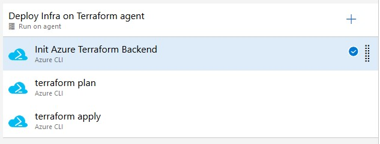
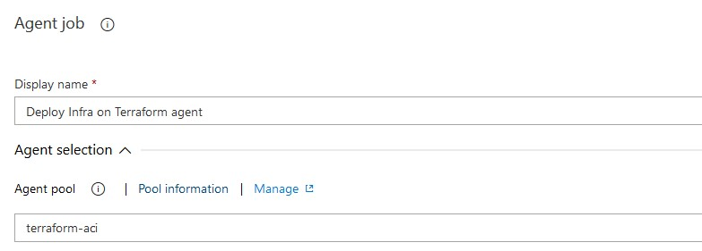
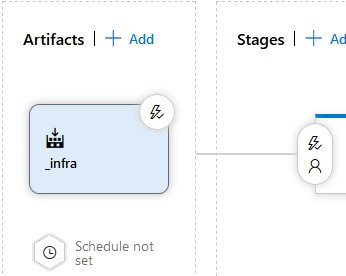

# Cloud Infrastructure on Azure with Terraform 

## What's the point?

Infrastructure as code provides many benefits, but sometimes at the expense of local developers who cannot create infrastructure from their own machines. This is in fact a huge and hidden problem, that can massively lower the productivity of software engineering teams.

This repository is a contribution on the subject of continuous deployment of infrastructure without sacrificing the developer experience. The core goals are:

 * Anyone can create and destroy infrastructure from their local machine.
 * A complete environment can be created from a minimum of configuration inputs.
 * Infrastructure can be continously deployed.
 * Infrastructure as code implies immutable and idempotent deployments.

In this project:

 * Everything is CLI, everything works in bash, everything runs in containers, and every script works locally.
 * [Terraform's HCL](https://www.terraform.io/docs/configuration/syntax.html) provides declarative infrastructure definitions.
 * Azure Pipelines continuously integrate and deploy infrastructure using custom and containerised [build and release agents](https://docs.microsoft.com/en-us/azure/devops/pipelines/agents/agents?view=vsts) running as [Azure Container Instances](https://docs.microsoft.com/en-us/azure/container-instances/) with [managed identities](https://docs.microsoft.com/en-us/azure/container-instances/container-instances-managed-identity).

In this example, we will deploy an Azure Web App with Terraform and Azure Pipelines. 

## Technologies

 * [Terraform](https://www.terraform.io/): Infrastructure definition and deployments
 * [Azure DevOps](https://dev.azure.com/): Continuous Integration and Deployment
 * [Azure Web Apps](https://docs.microsoft.com/en-us/azure/app-service/app-service-web-overview) Application host

## Get started locally

All terraform commands can be run via bash scripts. Scripts ending in `.local.sh` are intended to be run on a developer's machine. In a CI/CD pipeline, `.local.sh` scripts should not be used.

### Running the shell

> `docker-compose run cli`

In the root directory, run the above for a local shell with terraform, helm, and Azure CLI installed. You can see the Dockerfile for this shell at [`docker/Dockerfile`](docker/Dockerfile)

### Authenticate Azure CLI

> `az login`

### Initialising Terraform

> `./src/init.local.sh`

You can edit [`src/init.local.sh`](src/init.local.sh) to suit your environment.

You will also need some secrets, which you can place in the `.secrets/` directory.

`init.local.sh` is a wrapper around `init.sh`, which initialises terraform with remote state in an Azure Storage account.

### Planning with Terraform

> `./src/plan.local.sh`

This script will use [terraform plan](https://www.terraform.io/docs/commands/plan.html). A `dev.local.tfplan` file will be created, which is referenced in `tfplan.local.sh`

### Create and Destroy Infrastructure with Terraform

> `./src/tfapply.local.sh`

You can edit  [`./src/tfapply.local.sh`](src/tfapply.local.sh) as you like. Any changes made to your terraform configuration will be applied to your Azure subscription, __but not to production!__

### Destroy Infrastructure

> `./src/plan-destroy.local.sh`
>
> `./tfapply.local.sh`

## Continuous Integration and Deployment

### Build/Release Agents

We use custom build agents running on Azure Container Instances. These agents have all the default Azure DevOps tools installed, plus terraform. The agents also are created with a Managed Identity that is given contributor access to the subscription. This is how terraform gains access to the Azure Resource Manager.

Firstly, [create a new agent pool](https://docs.microsoft.com/en-us/azure/devops/pipelines/agents/pools-queues?view=vsts#creating-agent-pools) in Azure DevOps called terraform-aci.

Then, [get a Personal Access Token](https://docs.microsoft.com/en-us/azure/devops/organizations/accounts/use-personal-access-tokens-to-authenticate?view=vsts#create-personal-access-tokens-to-authenticate-access) from Azure DevOps, and copy into into `.secrets/vststoken.secret`

To create an agent, edit and run the following script:

> `./agents/create-agent.sh -t "$(cat .secrets/vststoken.secret)" -g tf-agents -n vs-agent -a <YOUR_AZUREDEVOPS_ACCOUT_NAME>`

Note, this can take several minutes as the image is large.

### Connecting Azure DevOps to Azure

You'll need to [set up a Service Connection](https://docs.microsoft.com/en-us/azure/devops/pipelines/library/connect-to-azure?view=vsts) to Azure. My connection is simply called `rian` but you can call yours something different, and rename it in `azure-pipelines.yml`

### CI

Continuous integration means changes in source code are continuously tested then merged into the main product. This project uses Azure Pipelines [yaml build definitions](https://docs.microsoft.com/en-us/azure/devops/pipelines/get-started-yaml?view=vsts). You can see the [build definition](azure-pipelines.yml) in the root of this project. In the build:

 * bash scripts are checked for validity
 * terraform files are checked for correct formatting
 * a terraform plan is generated (but not used)

### CD

We're going to use Azure Pipelines to continously deploy our infrastructure.

Since all our tools are bash scripts, we are just going to run three Azure CLI tasks.

#### Task Configuration

##### Init Azure Terraform Backend

 * Set the Script Path to `$(System.DefaultWorkingDirectory)/_infra/prod-drop/src/init.sh`
 * Set the arguments to `-g $(tfstate.resourcegroup) -a $(tfstate.storageaccountname) -e $(environment)`

##### terraform plan

 * Set the Script Path to `$(System.DefaultWorkingDirectory)/_infra/prod-drop/src/plan.sh`
 * Set the arguments to `-e $(environment) -g $(tfstate.resourcegroup) -a $(tfstate.storageaccountname) -p "$(System.DefaultWorkingDirectory)/terraform.tfplan" -f "$(System.DefaultWorkingDirectory)/tfplan-now.summary.txt"`

##### terraform apply

 * Set the Script Path to `$(System.DefaultWorkingDirectory)/_infra/prod-drop/src/tfapply.sh`
 * Set the arguments to `-p "$(System.DefaultWorkingDirectory)/terraform.tfplan"`

#### Job Configuration

On the agent job, make sure you choose the `terraform-aci` agent pool.

#### Artifacts Configuration

Select the build (it's defined in `azure-pipelines.yml`) as your artifact, and name it `_infra`

### Azure DevOps Build and Release variables

Set the following variables in your release pipeline

 * `tfstate.resourcegroup` : the resource group for your terraform state storage account
 * `tfstate.storageaccountname` : the name of the storage account for your terraform state
 * `environment` : i.e. dev, prod. not necessarily used but useful

## Local Secrets

Most secrets should be pulled from Azure CLI at runtime. For secrets that cannot, create a `.secrets` directory in the root of the project.

 * `vststoken.secret` -> Personal Access Token for Azure DevOps (used by release agent) 
